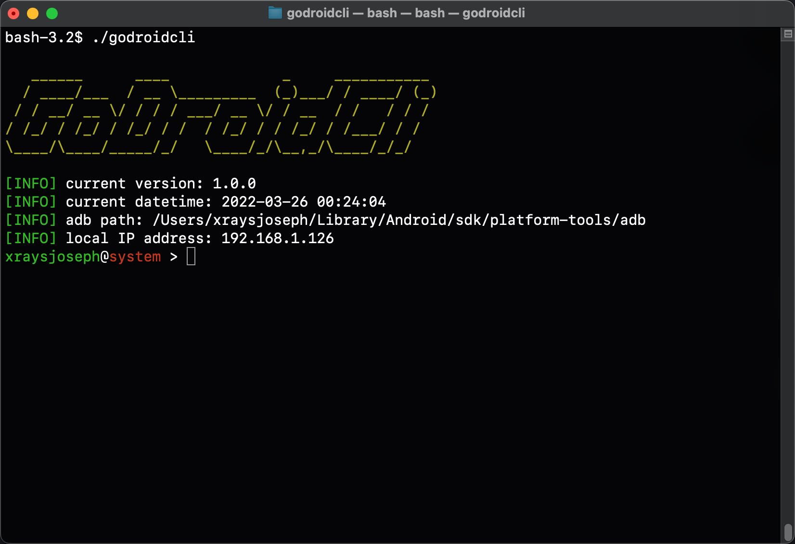
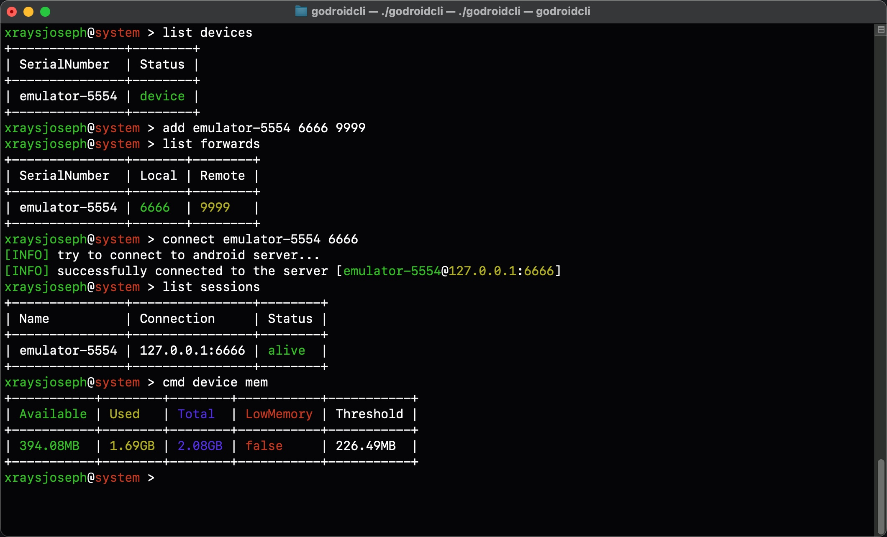
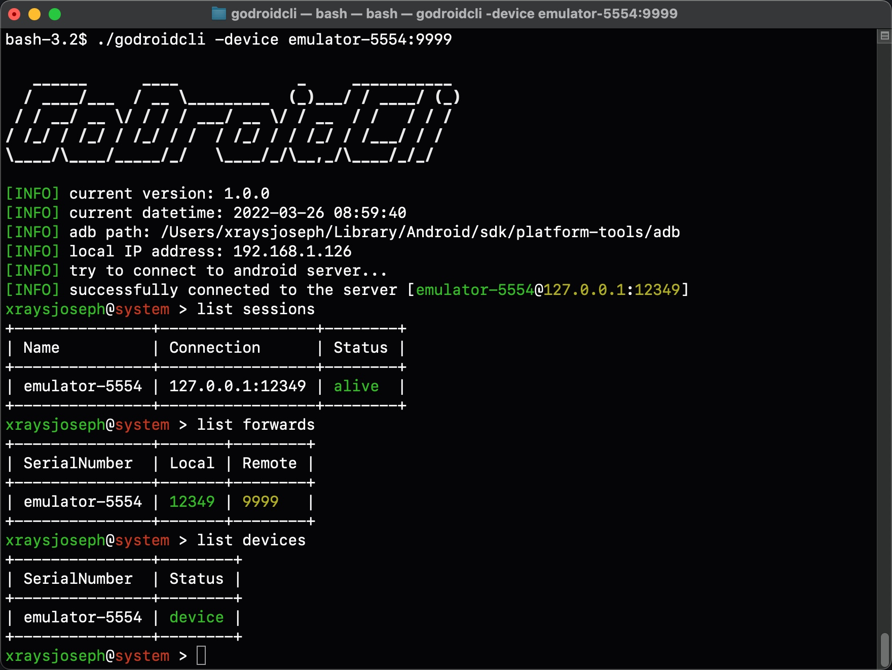
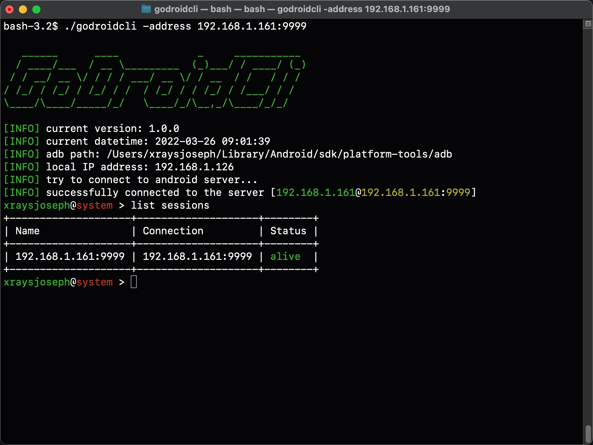

## GoDroidCli
GoDroidCli是使用Go开发的gRPC客户端，支持Linux、macOS、Windows平台

## 主要特性
- CS之间通过gRPC通信，使用ProtoBuf序列化数据
- 服务器支持WebSocket实现实时投屏，在带宽高的情况下效果良好（需要前端支持）
- 客户端可作为中间代理向外提供API服务，即采用传统HTTP1.1实现前后端分离（可使用React或Vue实现）
- ......

其中API响应JSON消息体样例位于 `android/api/json` 目录下

启动界面如下：



## How to use
git clone该项目，使用 VSCode/GoLand 打开子项目 godroidcli，编译后将会得到一个二进制文件
```bash
# 通过makefile编译 或者 go build -ldflags="-s -w" -o godroidcli .
make build
# 运行
./godroidcli
```

更详细的使用方式位于 `screenshots` 目录下
> PS: 如果是真机测试，需要将godroidsvr和godroidcli位于同一局域网下，或者也可以通过USB连接到宿主机上（不推荐）

### godroidcli连接到godroidsvr
连接方式主要有两种，且均支持USB和WLAN连接
- 在客户端程序内手动连接
- 在客户端程序执行时自动连接

#### USB



#### WLAN


## Issue \& PR
该项目独自一人开发，因此在开发的过程中难免出现一些问题或者BUGS，欢迎提交Issue或者PR🎉