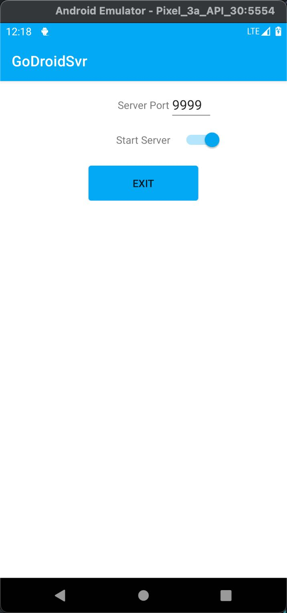

## GoDroidSvr
GoDroidSvr是使用Java开发的Android gRPC服务器，需要 godroidcli 客户端才能正常工作。

## How to use
git clone该项目，使用 Android Studio 打开子项目 godroidsvr 编译为apk文件并安装到Android设备即可。

启动后的界面如下，十分简洁，因为我们只需手动启动gRPC服务即可。

## Issue \& PR
由于本人对Android开发了解得不是十分深入，如果有更好的想法或者意见可以提Issue或者提交PR😄